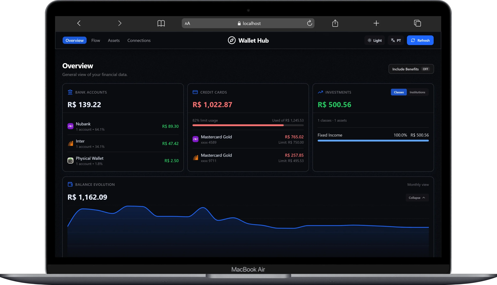
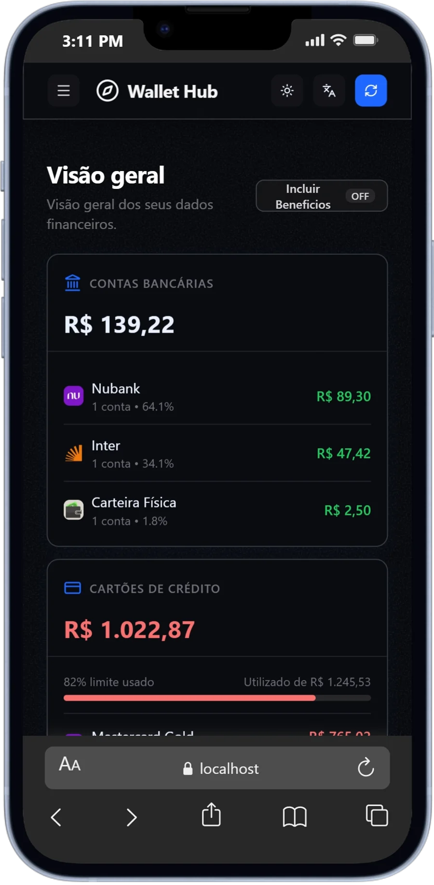

# Wallet Hub

Wallet Hub is a personal Open Finance dashboard built with Pluggy data integration. It consolidates bank accounts, credit cards, investments, and transactions into a single interface with dedicated Overview, Flow, Assets, and Connections pages.

|  |  |
| --- | --- |

## Overview

- Consolidated financial dashboard with real account data.
- Read-only Open Finance integration through Pluggy.
- Dedicated pages:
  - `/` Home (landing)
  - `/overview` Overview
  - `/flow` Cash Flow
  - `/assets` Assets
  - `/connections` Data Passport
- Localized UI (`PT`/`EN`) with `dark` and `light` themes.

## Core Features

- **Open Finance Integration:** Read-only bank, credit, and investment sync via Pluggy (BYOK).
- **Smart Manual Imports:** Support for physical wallets and CSV imports for non-Open Finance accounts (e.g., Pluxee/Sodexo benefits).
- **Intelligent Parsing:** Automatically identifies Internal Transfers vs. actual Expenses/Incomes to prevent double-counting in cash flow metrics.
- **Benefits Toggle:** Isolate consumable benefits from your core financial wealth with a global UI toggle.
- **Financial Health:** Real-time metrics evaluating spending, debt, and savings strictly based on liquid banking assets.
- **Local First & Secure:** All credentials and manual data are stored locally in the browser (`localStorage`) with full Export/Import JSON backup capabilities.
- **Dynamic Logos:** Backend proxy endpoint to reliably resolve institution logos without CORS issues.

## Tech Stack

- **Frontend:** React 19, Vite, React Router, Recharts, Lucide.
- **Backend:** Node.js, Express, Pluggy SDK.

## Architecture

- `frontend/`: React + Vite SPA.
- `backend/`: Node.js + Express API proxy for Pluggy.

Data flow:

1. Frontend requests `GET /api/dashboard-data`.
2. Backend queries Pluggy (accounts, investments, transactions).
3. Backend returns consolidated payload.
4. Frontend computes view metrics and renders cards/charts/lists.
5. Frontend logo resolver requests `/api/logo-proxy?domain=...` for institution logos.

## Pluggy Resources

- Meu Pluggy: `https://meu.pluggy.ai/`
- Pluggy Dashboard: `https://dashboard.pluggy.ai/`
- Meu Pluggy GitHub repo: `https://github.com/pluggyai/meu-pluggy`

## Getting Started

### 1) Setup

Clone or download the project, then install dependencies for all packages:

```bash
npm run install:all
```

### 2) Environment

Pluggy credentials are provided by the user at runtime (BYOK) in the UI (`Connections` page).

### 3) Start Development

From the root folder:

```bash
npm run dev
```

This will start both the backend API server (`http://localhost:3000`) and the frontend dev server (`http://localhost:5173`) simultaneously.

### 4) Stop or Restart Development

From the root folder:

```bash
npm run stop
```

Stops both backend and frontend dev servers by freeing ports `3000` and `5173`.

```bash
npm run restart
```

Stops both servers and starts them again in one command.

**Frontend default URL:** `http://localhost:5173`

### 5) BYOK Flow (Bring Your Own Key)

1. Open `/connections`.
2. Click `+ Nova conexão` or `+ New connection`.
3. Fill in:
	- Pluggy Client ID
	- Pluggy Client Secret
	- Item IDs (comma or line separated)
4. Save credentials.

The frontend stores these credentials in browser `localStorage` and injects them into backend request headers.

### 6) Data Backup & Restore

**Export Backup:**
1. Navigate to `/connections` page.
2. Click the `Export` button in the connections header.
3. A JSON file (`wallet-hub-backup-YYYY-MM-DD.json`) downloads automatically.
4. Store this file safely for future recovery.

**Import Backup:**
1. Navigate to `/connections` page.
2. Click the `Import` button in the connections header.
3. Select a previously exported JSON backup file.
4. Confirm the import — all data (manual connections, transactions, and API credentials) will be restored.
5. The app automatically reloads to display restored data.

**Backed-up Data:**
- Manual wallet connections and balances
- Manual wallet transaction history
- Pluggy API credentials (Client ID, Client Secret, Item IDs)

## Security Notes

- Bring Your Own Key: API keys are never stored on the server.
- Read-Only: The app only requests read permissions for financial data.
- Local Storage: Keep your exported JSON backups safe, as they contain your API credentials and manual history.

## Roadmap

- Encrypted backup storage option
- Automated backup scheduling
- Upcoming payments and bill tracking features
- Automated tests for data normalization and financial totals
- Further UI/UX refinements and accessibility improvements
